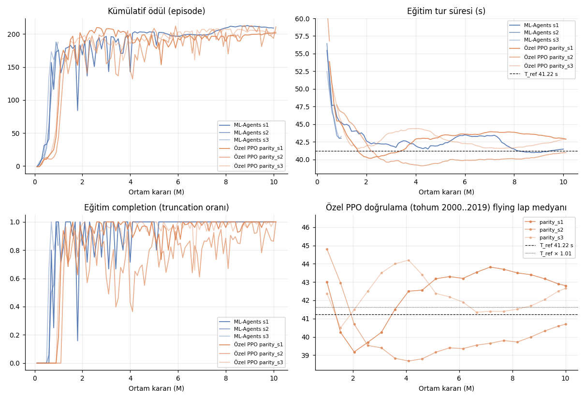
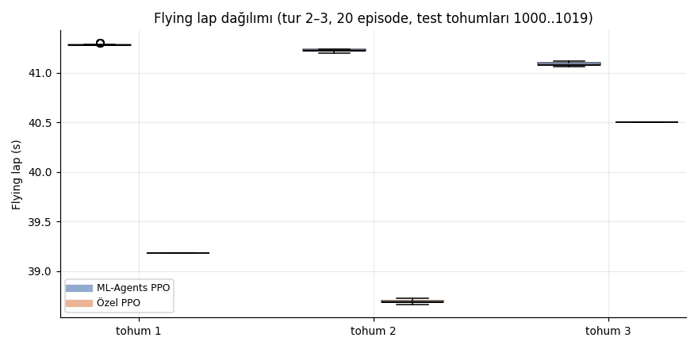
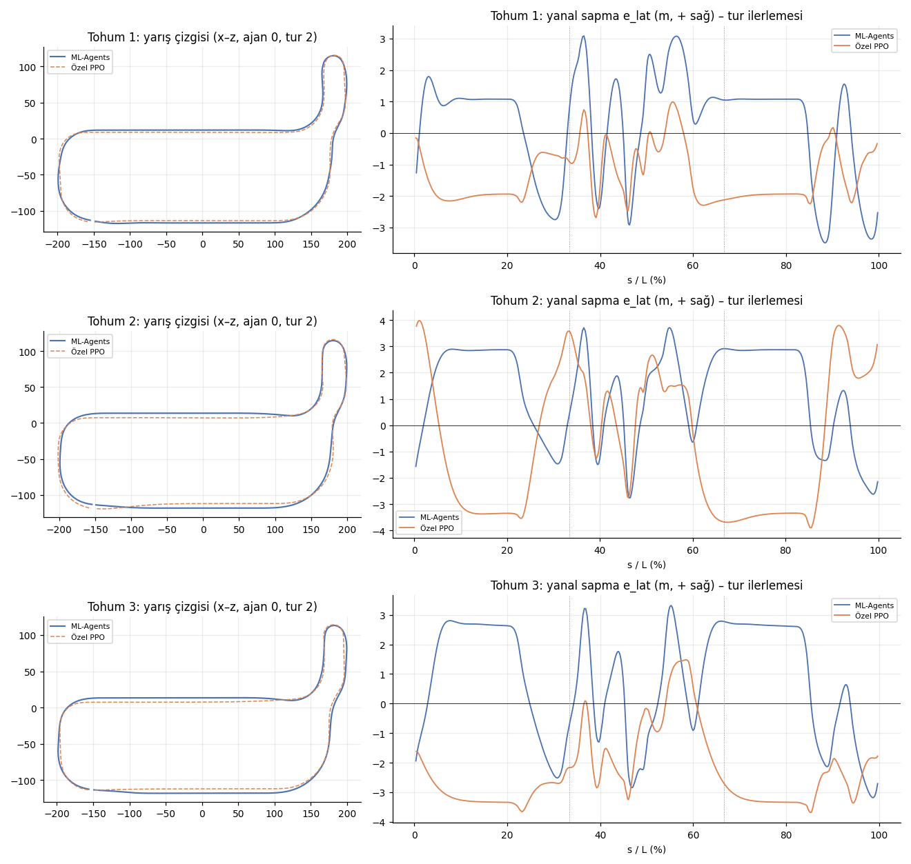
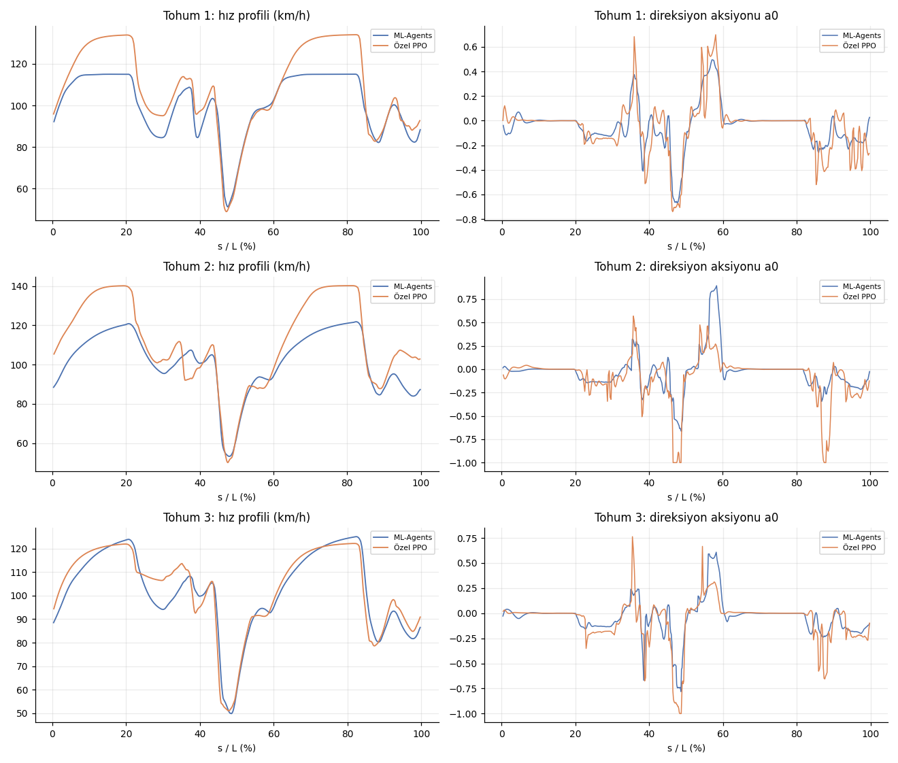
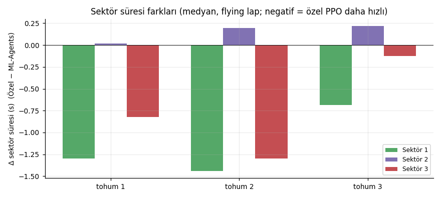

# M5 Final Raporu: Özel PyTorch PPO ve ML-Agents PPO Kıyası

**env_config_hash:** `90240ee2b1a58b5b` (iki raporda eşit, C0.11) · **obs_layout_hash:** `b40ca79bdba1c2c2` · **Unity:** 6000.4.6f1 · **build_id:** `1c6af42e1ed2481fbbb15a49da198c82` · **Değerlendirici:** `bridge` (ikisi için aynı)

C0.10: 20 episode, EvalGrid, test tohumları 1000..1019, 3 tur, deterministik μ. Özel PPO modeli `best.pt`, doğrulama tohumları 2000..2019 üzerinde seçildi (C0.19).

## DoD

| Ölçüt | Hedef | Sonuç | |
|---|---|---|---|
| Flying lap medyanlarının tohum medyanı | ≤ T_ref × 1.01 = 41.63 s | 39.18 s (T_ref 41.22 s) | ✅ |
| Her tohumda completion_rate | ≥ 0.95 | 1.00 / 1.00 / 1.00 | ✅ |
| env_config_hash eşit | `90240ee2b1a58b5b` | `90240ee2b1a58b5b` | ✅ |

## Özet

- **DoD geçti.** Özel PyTorch PPO'nun `best.pt` modelleri test tohumlarında (1000..1019) **39.18 s** tohum medyanı verdi. Bu, T_ref'in (41.22 s) **%4.95 altında**. Üç tohumun hepsi ML-Agents'ı geçti: 39.18 / 38.68 / 40.50 s. Her tohumda completion 1.00.
- **ML-Agents köprü değerlendirmesi M2/M3 ile birebir aynı:** 41.28 / 41.22 / 41.08 s. Resmi kıyasta iki politika da aynı build, aynı değerlendirici (`racing_rl.train.evaluate`) ve aynı tohumlarla koşuldu.
- **Hız farkının kaynağı düzlüklerdeki son hız.**
  - Özel PPO düzlüklerde tam gaza gidiyor ve 134–140 km/h'e çıkıyor; ML-Agents 115–125 km/h'te kalıyor. Tam gazda geçen süre payı 0.36–0.40'a karşı 0.06–0.29.
  - Fren noktaları ve viraj içi en düşük hızlar neredeyse aynı (≈ 50 km/h).
  - Kazanç sektör 1 ve 3'te (düzlükler): tohum medyanı −0.93 s ve −0.77 s. Sektör 2 (virajlı bölüm) +0.21 s ile ML-Agents lehine.
- **Yarış çizgisi farklı.** Özel PPO düzlüklerde orta çizginin 2–3.5 m soluna yerleşiyor, ML-Agents 1–3 m sağında (`e_lat` grafiği). İki politika virajlara farklı taraftan giriyor.
- **Bedeli direksiyon pürüzsüzlüğü.** `steer_smoothness` 0.0358'e karşı 0.0197 (+%82). Özel PPO virajlarda daha sert ve titrek direksiyon kullanıyor; 2. tohumda sonuna kadar kırıp (a0 = −1) düzeltme yapıyor. Ödüldeki `wSmooth` cezası (0.02) hızın getirisine göre küçük kaldığı için ajan bu takası kabul ediyor.

## Zirve sonrası gerileme ve model seçimi (C0.19)

Özel PPO'da doğrulama tur süresi 1.5–4M karar arasında en iyi değerine ulaşıyor. Sonra tohuma göre 1.5–4 s geriliyor ve lr sıfıra yaklaştıkça kısmen toparlanıyor. Tohum başına en iyi nokta ve 10M'deki son değer:

| Tohum | En iyi (adım) | 10M son |
|---|---|---|
| 1 | 39.18 s (2.05M) | 42.80 s |
| 2 | 38.68 s (4.10M) | 40.70 s |
| 3 | 40.50 s (1.54M) | 42.66 s |

- Gerileme dönemlerinde eğitim ödülü de düşüyor (s1: 209 → 197), yani bu yalnız "ödülü artırıp turu yavaşlatma" değil.
- Aynı dönemlerde stokastik politikada ara ara duvar çarpması patlamaları görülüyor (%12–25). Ardından politika temkinli sürüşe kayıyor ve σ küçüldükçe bu noktadan tam çıkamıyor.
- ML-Agents s1'de böyle bir gerileme yok (1M: 43.31 s → 10M: 41.28 s). Olası nedenler C0.19'daki kod düzeyindeki farklar (minibatch avantaj normalizasyonu, T = 160 GAE ufku, gradyan kırpma) ile 128 paralel ajanla güncelleme başına daha çeşitli veri. Bu M5'te ayrıca izole edilmedi.
- **Model seçimi:** Kullanıcı kararıyla birincil metrik `best.pt`. Seçim doğrulama tohumlarında (2000..2019) yapıldı, test tohumlarında (1000..1019) raporlandı. EvalGrid pertürbasyonu (±0.5 m, ±2°) deterministik politika için çok küçük olduğundan doğrulama ve test sonuçları tohum başına aynı çıktı (ör. s1 39.18 / 39.18 s). Yani seçim yanlılığı pratikte ölçülemeyecek kadar küçük. Son checkpoint ve 1M anlık görüntüsü aşağıdaki tablolarda ayrı sütunlarda veriliyor.
- **Son checkpoint ile kıyas:** T = 42.66 s, T_ref'e göre +%3.5; DoD'u geçmiyor.
- **1M anlık görüntüsü ile kıyas:** T = 43.10 s. ML-Agents'ın 1M modelleri (s2 41.22 s, s3 41.08 s) aynı adımda daha iyi. Özel PPO'nun zirvesi daha geç geliyor (1.5–4M).
- **Örnek verimliliği:** Eğitim telemetrisinde ilk 3 tur 799k kararda (ML-Agents: 440k), %95 completion 1.11M kararda (ML-Agents: 680k). Buna karşın duvar saati verimliliği çok daha yüksek (aşağıda).

## Hız (SPS) ve altyapı

| | ML-Agents (M2) | Özel PPO (M5) |
|---|---|---|
| Paralellik | 3 süreç × 16 ajan, `time_scale 20`, gRPC | 4 süreç × 32 ajan, script modu, özel TCP köprüsü |
| Eğitim hızı (toplama + güncelleme) | ~3,000 karar/s (tek koşu) | **~14,000 karar/s** (toplama ~22k, güncelleme 0.5 s / 20,480 örnek) |
| 1e7 karar | 0.94 sa | **0.23 sa** (13.8–15.3 dk, eval dahil) |

- **SPS probu** (`eval/m5_sps_probe.json`, `eval/m5_sps_probe_policy.json`):
  - Rastgele aksiyonla ölçekleme doğrusala yakın: 8×1 = 6.5k, 16×4 = 25.5k, 32×4 = 28.9k karar/s.
  - p99 gecikme en fazla 5.8 ms (sınır 50 ms).
  - Politika çalışırken 32×4 = 23.7k karar/s.
- **Tekrar üretilebilirlik** (`eval/m5_repro.json`): iki taze süreçte (4 Unity + Python) aynı config ve tohumla ilk 2 güncellemenin 42 metriği `float.hex` düzeyinde aynı.
- **Hata yönetimi:**
  - Üç koşuda da 0 Unity restart.
  - Çökme kurtarma, `--resume` ve Ctrl+C yolları mock testlerle doğrulandı (`tests/test_m5_train.py`). Kapsanan senaryolar: süreç ölümü → rollout atılır → yeniden başlatma; kaldığı yerden devam; TensorBoard ve CSV satırlarının temizlenmesi.

## Parite ve sapmalar

- **Kayıp ölçeği (config ile):**
  - ML-Agents entropinin aksiyon boyutları üzerinden ortalamasını, `racing_rl` toplamını alıyor; bu yüzden `ent_coef` 2.5e-3 → 5e-6 (β/2) yapıldı.
  - Değer kaybı için `vf_coef` 1.0 kullanıldı.
  - Bu ayarlarla kayıp terimleri ML-Agents 1.1 ile birebir aynı (C0.19).
- **Kod düzeyindeki farklar (değiştirilmedi, M4 mühürlü):**
  - Avantaj normalizasyonu minibatch bazında (ML-Agents: tüm buffer).
  - GAE ufku T = 160 (ML-Agents `time_horizon` 128).
  - Gradyan normu 0.5 ile kırpılıyor (ML-Agents kırpmıyor).
  - ε_v sabit 0.2.
- **Kapsam:** Ayar merdiveni kullanılmadı; `parity` ön ayarı (1. basamak) hedefi ilk denemede geçti. `ppo_default.yaml` ablasyonu koşulmadı.

## Kafa kafaya (tohum medyanları)

Birincil karşılaştırma: **Özel best.pt** (C0.19). 1M anlık görüntüsü ve 10M son checkpoint şeffaflık için aynı test protokolüyle ayrı sütunlarda.

| Metrik | ML-Agents PPO | **Özel best.pt** | Δ% (best.pt) | Özel 1M | Δ% (1M) | Özel son | Δ% (son) |
|---|---|---|---|---|---|---|---|
| Flying lap medyanı (T, s) | 41.22 | **39.18** | -4.95% ✅ | 43.10 | +4.56% ⚠️ | 42.66 | +3.49% ⚠️ |
| Flying lap en iyi (s) | 41.06 | **38.66** | -5.85% ✅ | 42.50 | +3.51% ⚠️ | 40.68 | -0.93% ✅ |
| 1. tur medyanı (s) | 44.32 | **42.68** | -3.70% ✅ | 46.22 | +4.29% ⚠️ | 45.64 | +2.98% ⚠️ |
| completion_rate (medyan) | 1.00 | **1.00** | +0.00% | 1.00 | +0.00% | 1.00 | +0.00% |
| completion_rate (en düşük) | 1.00 | **1.00** | +0.00% | 1.00 | +0.00% | 1.00 | +0.00% |
| Ortalama hız (m/s) | 26.73 | **28.13** | +5.21% ✅ | 25.74 | -3.71% ⚠️ | 25.98 | -2.83% ⚠️ |
| steer_smoothness (ort. |Δa0|) | 0.0197 | **0.0358** | +81.79% ⚠️ | 0.0306 | +55.30% ⚠️ | 0.0236 | +19.53% ⚠️ |
| Sektör 1 (s) | 12.79 | **11.86** | -7.26% ✅ | 13.20 | +3.19% ⚠️ | 13.41 | +4.81% ⚠️ |
| Sektör 2 (s) | 15.21 | **15.42** | +1.42% ⚠️ | 15.88 | +4.42% ⚠️ | 15.54 | +2.21% ⚠️ |
| Sektör 3 (s) | 13.21 | **12.44** | -5.81% ✅ | 13.87 | +5.01% ⚠️ | 13.71 | +3.77% ⚠️ |
| İlk 3 tur (karar, eğitim) | 440,000 | 798,720 | +81.53% ⚠️ | | | | |
| %95 eğitim completion (karar) | 680,000 | 1,105,920 | +62.64% ⚠️ | | | | |
| Toplam eğitim kararı (3 tohum) | 11,999,928 | 30,044,160 | | | | | |
| Duvar saati (3 tohum, saat) | 1.17 | 0.72 | | | | | |

Δ% = (Özel − ML-Agents) / ML-Agents; eğitim satırları koşu düzeyindedir (checkpoint'e bağlı değil). ✅ özel PPO lehine, ⚠️ aleyhine. Örnek verimliliği satırları eğitim telemetrisinin (M2 ile aynı tanım: `Race/Laps3Rate > 0`, `Race/CompletionRate ≥ 0.95`) tohum medyanıdır.

### Checkpoint matrisi: flying lap medyanı (completion)

| Tohum | ML-Agents (resmi model) | **Özel best.pt** (adım) | Özel 1M | Özel son checkpoint (adım) |
|---|---|---|---|---|
| 1 | 41.28 s (1.00) | **39.18 s (1.00)** @2,048,000 | 43.10 s (1.00) | 42.80 s (1.00) @10,014,720 |
| 2 | 41.22 s (1.00) | **38.68 s (1.00)** @4,096,000 | 44.52 s (1.00) | 40.70 s (1.00) @10,014,720 |
| 3 | 41.08 s (1.00) | **40.50 s (1.00)** @1,536,000 | 42.50 s (1.00) | 42.66 s (1.00) @10,014,720 |

## Tohum bazında (test tohumları 1000..1019)

| Tohum | Politika | Model (adım) | completion | Flying medyan / en iyi (s) | 1. tur (s) | Ort. hız (m/s) | steer_smoothness | Sektörler (s) | Sonlanma |
|---|---|---|---|---|---|---|---|---|---|
| 1 | ML-Agents | 10,000,031 | 1.00 | 41.28 / 41.28 | 44.32 | 26.62 | 0.0182 | 13.16 / 14.86 / 13.27 | {"finished": 20} |
| 1 | Özel | 2,048,000 | 1.00 | 39.18 / 39.18 | 42.68 | 28.13 | 0.0358 | 11.86 / 14.88 / 12.44 | {"finished": 20} |
| 2 | ML-Agents | 999,947 | 1.00 | 41.22 / 41.20 | 44.40 | 26.76 | 0.0197 | 12.79 / 15.25 / 13.18 | {"finished": 20} |
| 2 | Özel | 4,096,000 | 1.00 | 38.68 / 38.66 | 42.34 | 28.63 | 0.0393 | 11.35 / 15.44 / 11.88 | {"finished": 20} |
| 3 | ML-Agents | 999,950 | 1.00 | 41.08 / 41.06 | 44.27 | 26.73 | 0.0209 | 12.68 / 15.21 / 13.21 | {"finished": 20} |
| 3 | Özel | 1,536,000 | 1.00 | 40.50 / 40.50 | 43.74 | 27.02 | 0.0304 | 11.99 / 15.42 / 13.08 | {"finished": 20} |

## Özel PPO: diğer checkpoint'ler (aynı test protokolü)

| Checkpoint | Tohum | completion | Flying medyan / en iyi (s) | 1. tur (s) | steer_smoothness |
|---|---|---|---|---|---|
| Son checkpoint | 1 | 1.00 | 42.80 / 42.80 | 45.78 | 0.0214 |
| Son checkpoint | 2 | 1.00 | 40.70 / 40.68 | 43.86 | 0.0394 |
| Son checkpoint | 3 | 1.00 | 42.66 / 42.58 | 45.64 | 0.0236 |
| **Son checkpoint özeti** | | medyan 1.00 | **T = 42.66** | | |
| 1,000,000 karar anlık görüntüsü | 1 | 1.00 | 43.10 / 43.10 | 46.22 | 0.0216 |
| 1,000,000 karar anlık görüntüsü | 2 | 1.00 | 44.52 / 44.50 | 47.66 | 0.0475 |
| 1,000,000 karar anlık görüntüsü | 3 | 1.00 | 42.50 / 42.50 | 45.54 | 0.0306 |
| **1,000,000 karar anlık görüntüsü özeti** | | medyan 1.00 | **T = 43.10** | | |

ML-Agents referansı (1M): s2 41.22 s, s3 41.08 s (1M checkpoint'leri resmi baseline); s1 1M'de 43.31 s (`eval/mlagents_s1_1M.json`).

## Eğitim koşuları (özel PPO)

| Koşu | Tohum | K × N | Toplam karar | best.pt adımı | İlk 3 tur | %95 completion | Duvar saati (sa) | Unity restart |
|---|---|---|---|---|---|---|---|---|
| parity_s1 | 1 | 4 × 32 | 10,014,720 | 2,048,000 | 757,760 | 1,105,920 | 0.23 | 0 |
| parity_s2 | 2 | 4 × 32 | 10,014,720 | 4,096,000 | 1,064,960 | 1,167,360 | 0.23 | 0 |
| parity_s3 | 3 | 4 × 32 | 10,014,720 | 1,536,000 | 798,720 | 942,080 | 0.26 | 0 |

## Sürüş karakteri (ajan 0, tur 2)

| Tohum | e_lat RMS farkı (m) | V_max ML / Özel (km/h) | V_min ML / Özel (km/h) | Tam gaz payı ML / Özel | Fren payı ML / Özel |
|---|---|---|---|---|---|
| 1 | 2.53 | 115.0 / 134.0 | 51.2 / 49.0 | 0.29 / 0.40 | 0.07 / 0.09 |
| 2 | 4.26 | 121.8 / 140.2 | 53.2 / 50.1 | 0.07 / 0.36 | 0.07 / 0.08 |
| 3 | 4.04 | 125.1 / 122.2 | 49.8 / 51.0 | 0.05 / 0.19 | 0.07 / 0.07 |

## Grafikler

**Öğrenme eğrileri (x: ortam kararı; ML-Agents 100k özet aralığı, özel PPO 100k kutulara ortalanmış)**

**Flying lap kutu grafiği**

**Yarış çizgisi bindirmesi ve yanal sapma**

**Hız ve direksiyon profili**

**Sektör süresi farkları**

## Kaynak dosyalar

- `mlagents_bridge.json`, `custom_ppo.json`: C0.10 şeması (`evaluator: bridge`).
- `eval/traces/*.npz`: karar başına iz (`racing_rl.train.evaluate --trace`).
- Yeniden üretme: `python scripts/m5_benchmark.py --runs ...` ardından `python -m racing_rl.train.compare ...`.
